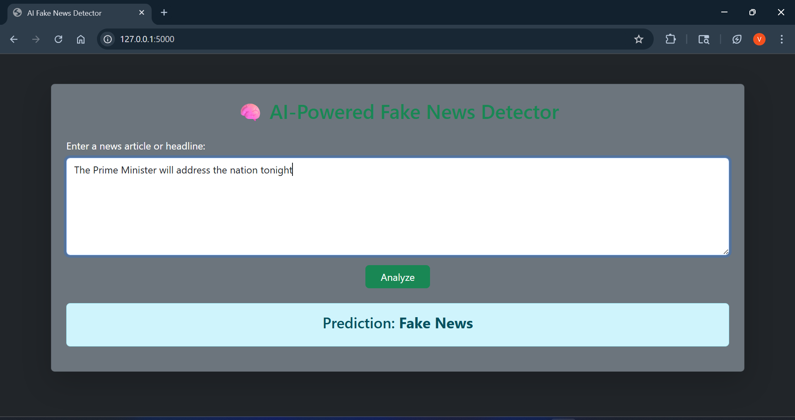

# 🧠 AI-Powered Fake News Detection System

A beginner-friendly web application that detects whether a news article is real or fake using machine learning and natural language processing (NLP). Built with Flask, Scikit-learn, and Bootstrap for a clean, responsive user interface.

---

## 🚀 Features

- 🔍 **NLP Preprocessing**: Tokenization, stopword removal, and TF-IDF vectorization
- 🧠 **ML Models**: Logistic Regression trained on sample data
- 📊 **Prediction**: Real-time prediction (Fake or Real) with web interface
- 🌐 **Web Interface**: Responsive Bootstrap UI with dark theme
- 💾 **Model Persistence**: Trained model and vectorizer saved with Joblib

---

## 🛠️ Tech Stack

- **Frontend**: HTML, CSS, Bootstrap 5
- **Backend**: Python, Flask
- **ML & NLP**: Scikit-learn, NLTK, TfidfVectorizer
- **Others**: Pandas, NumPy, Joblib

---

## 📁 Project Structure

```
fake-news-simple/
│
├── app.py                   # Flask web server
├── train_model.py           # Script to train and save model
├── model.pkl                # Saved ML model
├── tfidf.pkl                # Saved TF-IDF vectorizer
├── sample_data.csv          # Sample labeled news dataset
├── templates/
│   └── index.html           # Web UI (Bootstrap based)
└── static/
    └── style.css            # Custom styling
```

---

## 🧪 Dataset

The sample dataset (`sample_data.csv`) contains a few news examples labeled as:
- `0` = Real news
- `1` = Fake news

You can expand this using real-world datasets like:
- [Kaggle Fake News Dataset](https://www.kaggle.com/c/fake-news)
- [LIAR Dataset](https://www.cs.ucsb.edu/~william/data/liar_dataset.zip)

---

## ⚙️ How to Run

### 1. Install dependencies
```bash
pip install flask scikit-learn pandas nltk joblib
```

### 2. Download NLTK stopwords
```python
import nltk
nltk.download('stopwords')
```

### 3. Train the model
```bash
python train_model.py
```

### 4. Run the web app
```bash
python app.py
```

Then open `http://localhost:5000` in your browser.

---

## 📸 Screenshot

 

---

## 📌 License

This project is open-source under the MIT License.

---

## 🤝 Contribution

Pull requests and feedback are welcome!

